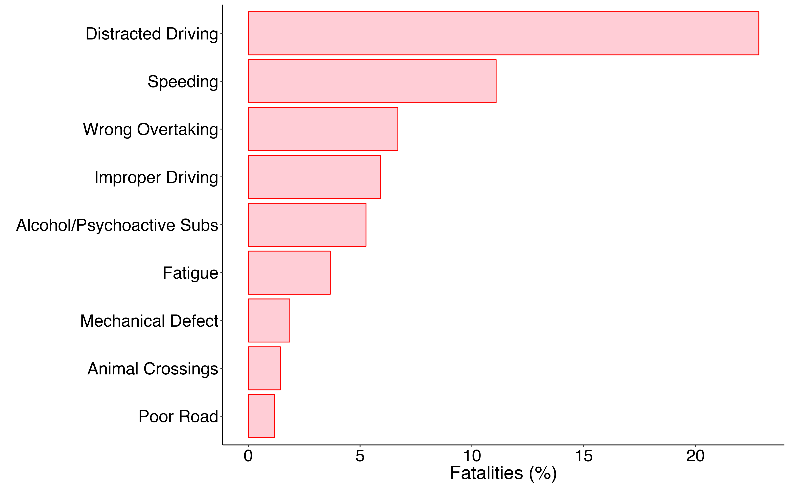
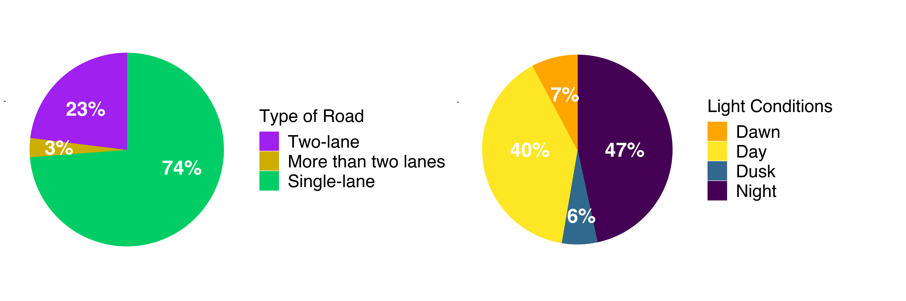
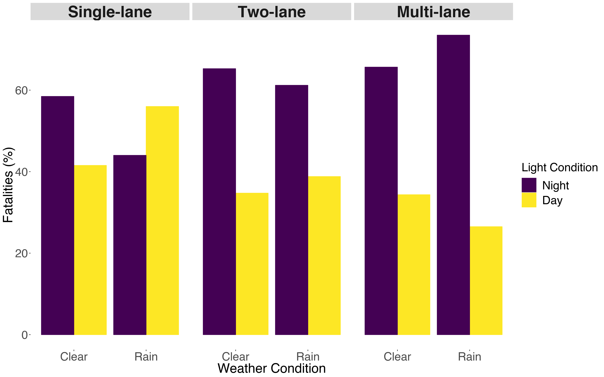
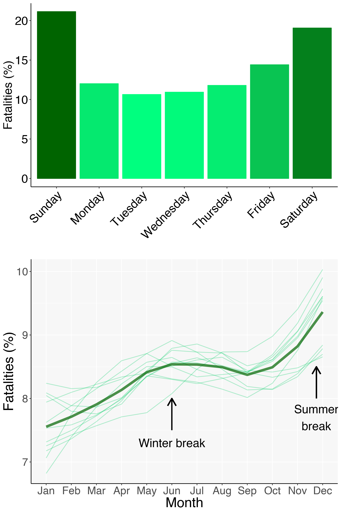
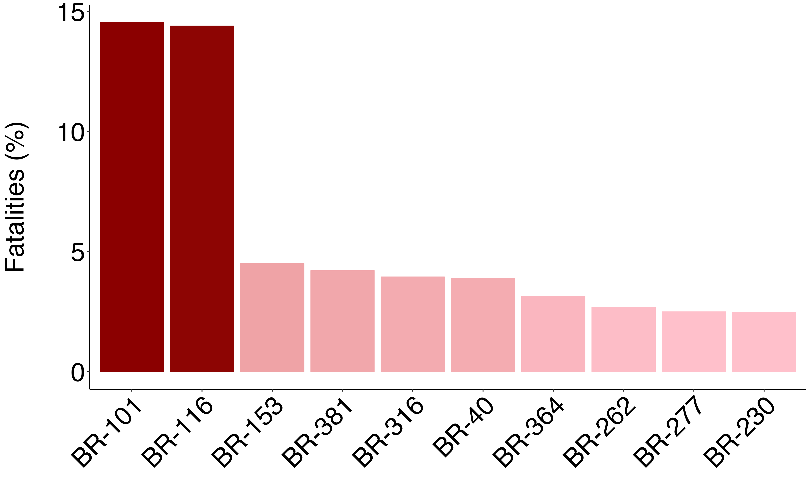
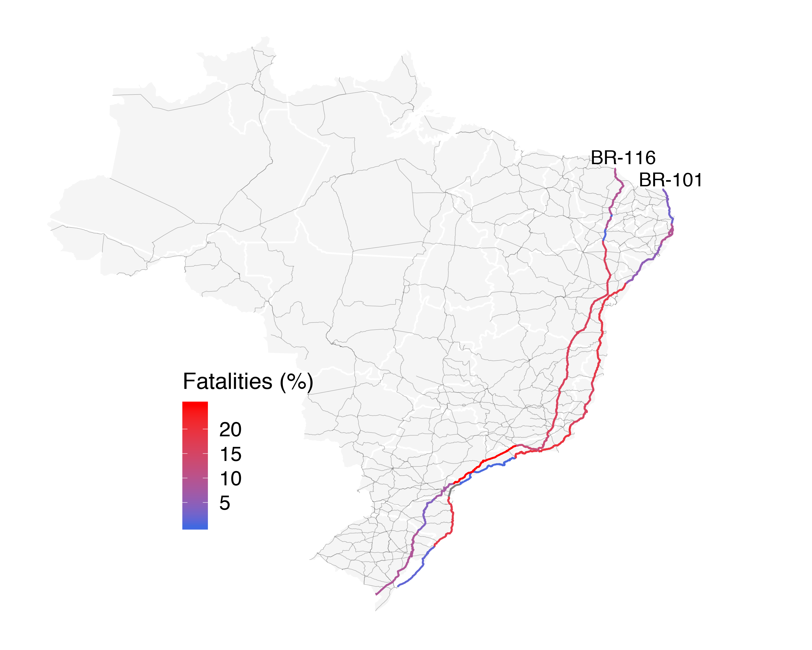
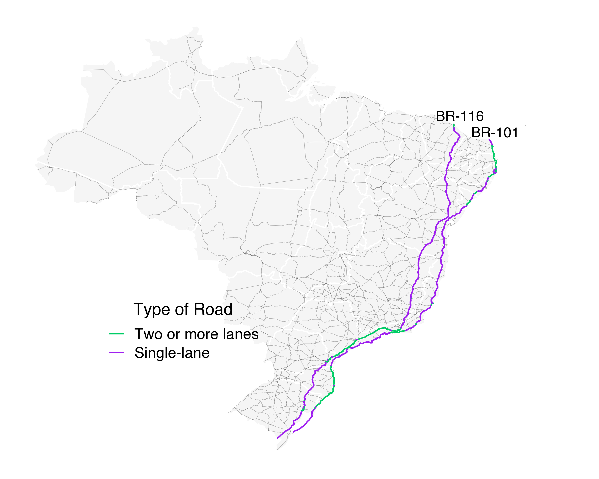

Prediction model to improve road safety in Brazil
================
Hamanda Badona Cavalheri
July 20, 2018

Goal
----

Few countries include road safety management as a regular activity and/or dedicate budget for safety road programms. Brazil is the fourth country with the highest rate of fatalities in traffic accidents and despite some effort, there is no initiative from the government to create a serious program that would allow road satefy measuments to be applied on a regular basis.

Thus, in this project I propose to develop a computer model that identifies the probability of road accidents at certain times and locations on federal roadways in Brazil. The model will be trained using historical data collected over the past ten years by the highway patrol. This data include details of each accident that happened in federal roads in Brazil, including, weather, time, type of road, number of vehicles involved as well as victims. Furthermore, in since 2017 coordinates have started to be included, which refines even more location.

Downloading the data
--------------------

Data was downloaded in csv format from Brazilian Highway Patrol website (<https://www.prf.gov.br/portal/dados-abertos/acidentes>). Data cleaning was performed to ensure that variables had the same classification across all data sets and the categories were translated to English.

The code containing all data cleaning 'data\_cleaning.R' is included on Github.

Map data was downloaded from the National Department of Transportation website (<http://www.dnit.gov.br/sistema-nacional-de-viacao/sistema-nacional-de-viacao>).

Exploratory analyses
--------------------

Figure 1 shows the causes of fatalities in federal highways in Brazil. 22.8% of all road falatilies is caused by distracted driving, followed by speeding (8.7%) and wrong overtaking (6.6%).

Figure 1. Main causes of accidents with fatal victims in Brazil.

Most of the accidents including fatal victims occured during the night and in single-lane roads (Figure 2). Figure 3 shows the percentage of fatal accidents that occurs during night or day time under clear or rainy weather condition for each type of road. In all types of road driving during the night increases the risk of accidents with fatal victims. However, the increase in risk differs between types of road. Interestly, in multi-lane and two-lane roads the risk is higher when driving during the night comparing with single-lane roads. This indicates that in single-lane roads the time of the day or weather does not change the risk for fatal accidents. In summary, single-lane roads are the ones with the most number of fatalites in any condition. Two-lane and multi-lane roads are safier but driving during the night increases risk of a fatal accident.

Figure 2. Proportion of fatalities per type of road and light condition.

Figure 3. Proportion of accidents with fatal victims that occur during the night or day when weather condition is clear or rainy for each type fo road.

As expected most accidents with fatal victims occur during the weekends and during school breaks (Figure 4).

Figure 4. Proportion of fatalities during weekdays and months.

The most dangerous roads in Brazil are BR-101 and BR-116. Combined 29% of all accidents with fatal victims in Brazil occur in these two highways. Figure 6 shows map of Brazil, in blue are all the federal roads and BR-101 and BR-116 are highlighted showing the proportion of fatalities per state. The highest proportions occur in the Southeast region of Brazil for both highways.

Figure 5. Proportion of fatalities for the 10 most dangerous roads in Brazil.

Figure 6. Brazil map including federal roads and highlighting BR-101 and BR-116 indicating the proportion of fatalities along those roads for each state.

In most of the southeastern part of BR-101 and BR-116 the roads are single-lane, which is probably the reason why the proportion of fatalities is high. However, in Sao Paulo state, BR-116 has two or more lanes, but there is still a high rate of mortality. The same happens for BR-101 in the South, Santa catarina state. This indicates that there are other factors that increase the number of fatalities in these parts of the highways and further exploration of the data is necessary.

Figure 7. Brazil map including federal roads and highlighting BR-101 and BR-116 indicating the type of road.

